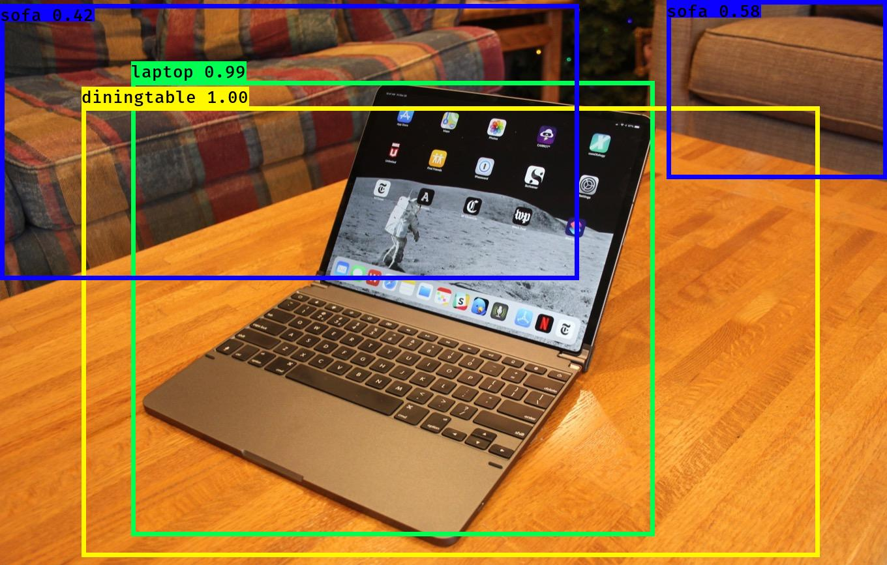
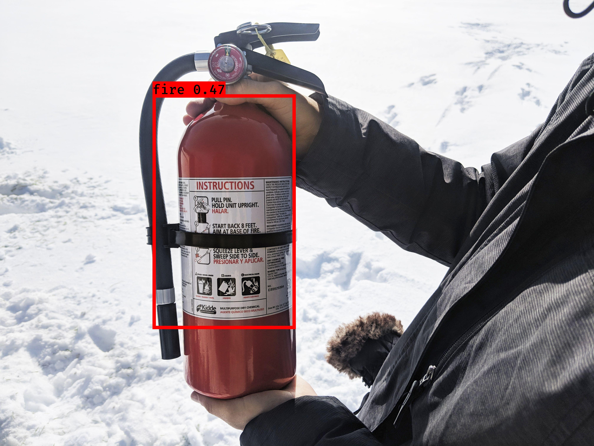

# YOLOv3 - CS5990_Project

CS5990 Deep Learning project to detect custom objects [using pre-trained weights and/or training a model with a specific dataset]

## Getting Started

These instructions will giude to get a copy of the project running and provide information on how to customize your run for custom object detection.

### Prerequisites

In order to run or train a model below packages are required* (Additional pagkage may required based on your current system configuration). Additionally to create labeled dataset on image for custom object detection, [LabelImage](https://github.com/tzutalin/labelImg) will be a useful repository.

```
Python3
Keras
matplotlib
opencv-python
pip
tensorflow (>= 1.12.0)
```

### One time setup

First, clone this repository.

```
git clone https://github.com/nambvp03/yolov3_keras.git
```

Download pre-trained weights with COCO dataset available on official [YOLO](https://pjreddie.com/darknet/yolo/) website.

```
#YOLOv3
wget https://pjreddie.com/media/files/yolov3.weights

#YOLOv3 tiny
wget https://pjreddie.com/media/files/yolov3-tiny.weights
```


## Running YOLOv3 object detection algorithm

As in this project we are using Keras, so before running algorithm to detect object we need to generate keras model based on darknet model.

### Generate Keras model.

YOLOv3 version model
```
python3 convert.py yolov3.cfg yolov3.weights model_data/yolov3.h5
```
YOLOv3 tiny version model
```
python3 convert.py yolov3-tiny.cfg yolov3-tiny.weights model_data/yolov3-tiny.h5
```

### Running object detection

Based on your requirement update 'model_path' param in [yolo.py](yolo.py) with path of original model or tiny model. Also update 'anchor_path' too before running object detection. There are two varient to execute object detection -- one for image and othe for video input.

```
#Image input
python3 yolo_video.py --image

#Video input
python3 yolo_video.py --input test_vdo.mp4
```

## Train a model on custom dataset

To train a model we need labeled dataset either available online or custom created as per application requirement. For this project I used VOC dataset to train a model available [here](http://host.robots.ox.ac.uk/pascal/VOC/voc2012/VOCtrainval_11-May-2012.tar) and I also created a small dataset of 21 images to detect fire extinguisher object on the imput image to test lower datase and its performance.

### Label generation

To create own dataset [LabelImage](https://github.com/tzutalin/labelImg) is very useful repository. You can drag the box over objects and assign them labels. For any dataset we need labeling file in following format. You can see sample file [fire_train.txt](fire_train.txt)

```
#Row format
image_file_path box1 box2 ... boxN

#Box format
x_min,y_min,x_max,y_max,class_id
```

> If you are using VOC dataset then their labeling format is different, you need to execute below command to get label file in required format.

```
#update file phat in python code before running
python3 voc_annotation.py
```

### Training

To tarin a model run below commands. Before running the command make sure 'annotation_path', 'classes_path' and 'anchors_path' are correct on [train.py](train.py)

```
python3 convert.py -w yolov3.cfg yolov3.weights model_data/yolo_weights.h5
python3 train.py
```

At the end you can find trained model in logs/000/ folder. To run object detection use newly trained \*.h5 for detection.

## Output

* Tested using a model trained on COCO dataset.

* Tested using a model trained on custom dataset (with 21 images on dataset :P) of fire extinguisher.


## Authors

* [**Bhargav Parekh**](https://github.com/nambvp03) CS5990 Deep Learning project


## License

This project is licensed under the MIT License - see the [LICENSE.md](LICENSE.md) file for details

## Acknowledgments

* [pjreddie](https://github.com/pjreddie/darknet) for algorithm in darknet
* [LabelImage](https://github.com/tzutalin/labelImg) for amazing image labeling software
* [qqwweee](https://github.com/qqwweee/keras-yolo3) for converting cfg to model in python
